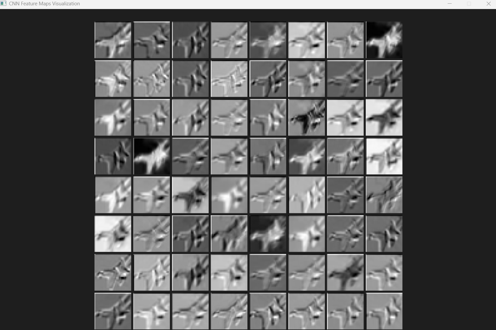
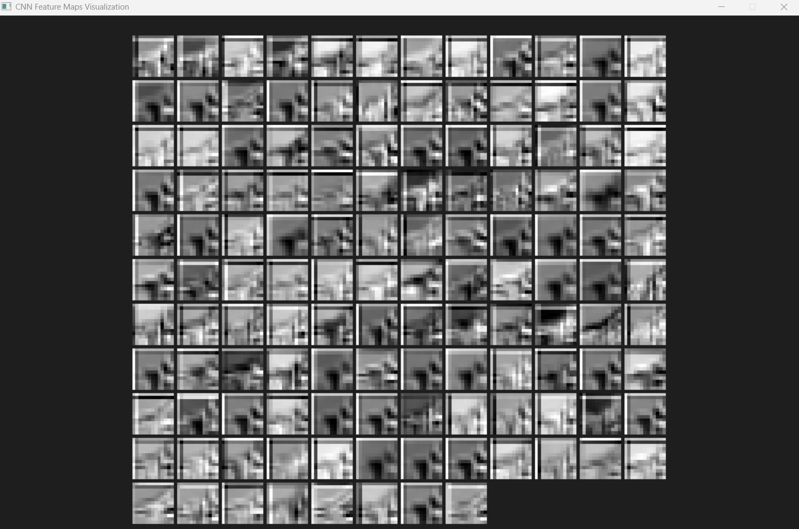

# Convolution Neural&nbsp;Network (NVIDIA GPU Implementation) on Windows for CIFAR-10 Dataset
This is a small, simple, solo, and personal project, which I attempt to gain insight into some features of coding on a GPU (NVIDIA GPU specifically) and try to reimplement the renowned Convolution Neural Network. The current version here is NOT optimized yet (in the Kernel aspect), so in the future, maybe it will be reviewed and upgraded when I acquire enough knowledge. The origin of this project is another project that I reimplemented the whole structure of the traditional Convolution Neuron Network using C++ Xtensor. This latest version is just the transformation from sequential execution to parallel calculation.

## Main Feature:
* **The current version supports some layers**: Convolution, Max Pooling, Linear, ReLU (Leaky ReLU), Softmax, Dropout (with input percentage).
* **Dataset link**: https://www.kaggle.com/c/cifar-10
- When starting, the program automatically creates and shuffles the Dataset from the folder /Dataset (CIFAR-10) with 10 classes. The dataset contains 60.000 images, of which 50.000 are training images and the rest are testing images.
* **Checkpoints**: Weights and Biases are stored in binary files in the folder /Checkpoints, and they are automatically saved and written into the files every time the latest Validation Loss is improved.
* **Early Stopping**: A limit of 20 is set so that if 20 epochs have passed since the last Weights and Biases file saving, the Model is stopped to prevent power consumption and potential overfitting. This is based on the Loss of the Validation test occurring in every epoch after the training process.
* **Data Augmentation**: The Dataset also includes some state-of-the-art Data Augmentation, such as Horizontal Flip, Pixel Shift, or blackening an area.
* **Mathematical basis**: During the process of working on the project, manual mathematical calculations were done to ensure the correctness of the theoretical fundamentals, and only then was the process of coding started.
* **Visualization**: The project is also composed of some utility stuff and a Python program to "plot" the result and the visualization of every kernel included in each convolution layer.

## Technical Feature:
* **Build from Scratch**: Re-implemention of every action in multi-threading in C++ and parallel computing in CUDA C++.
* **Get the batch for the next round**: Thanks to ```std::chrono``` and ```cudaEventRecord``` measurement, I was able to find out that data loading, although implemented in multi-threading, still took ~3.14ms to be done. On the other hand, the forwarding and backwarding took ~3.17 ms to run. So, the future batch fetching has been attached in order to get the batch of the next round of training, and the run time has decreased from ~3.14 + ~3.17 = ~6.31 to max(~3.14, ~3.17) = ~3.17. More details in Pull Request.
* **Multi-threading**: The dataset is designed to take advantage of multi-threading in C/C++ so that it can gain some speed-up during the batch division process. SDL2 is chosen to use in Dataset to read images manually.
* **Prevent data copying**: This project endeavors to keep the data on the VRAM of the GPU as long as possible to prevent data copying between Host (RAM &amp; CPU) and Device (VRAM &amp; GPU) due to the technical limitations of the throughput of the procedure.&nbsp;
* **Streaming**: a loop iterates through each layer in order to update Weights and Biases, which is enhanced by using Streaming on the GPU.
* **Visualization**: using pure SDL2 to create many Windows to visualize every kernel in the Model.
* **Tool of cuBLAS**: utilizing matrix multiplication tools (which read a matrix in column major) to calculate at the Linear Layer.
* **Syntax**: The model is only tested to be run on the Windows environment and Visual Studio Code specifically, so I can not use the common syntax such as ```saxpy<<<blocksPerGrid, threadsPerBlock>>>(N, a, d_x, d_y);```. Instead, the CPP acts as a front-end, and the CU acts as a Back-end. The CPP will have to use a Driver_Singleton to load a function in CU, and it is called through a the bult-in function ```CUresult res = cuLaunchKernel(k_conv_forward, grid.x, grid.y, grid.z, block.x, block.y, block.z, 0, 0,&nbsp; args, 0 );```
* **Memory leak on RAM & VRAM**: Ensure deallocation in VRAM after the model terminates to prevent potential memory leaks.

## Demo:
Press the video below to see how to run the project.
> **Note**: This video was recorded by Clipchamp, which was using some GPU resources at the time of recording, so the program executed more slowly than normal.
[](https://youtu.be/qIfoXoPS5Pk?si=FiXC_C_kWZkik296)
## How to run:
0. **Important Reminder**: This version of CNN only runs on Windows, not the WSL subsystem or Linux.
1. Check if your device has ```make``` on PowerShell or Command Prompt:
   ```bash
    make --version
    ```
   If you haven't installed ```make``` yet, you can use ```choco``` or ```scoop``` , or try this: https://stackoverflow.com/questions/32127524/how-can-i-install-and-use-make-in-windows

2. Choose your desired option by altering defines in ```Program.cpp```:

| Define | Description |
| :--- | :--- |
| `#define READY` | Must be defined to start the Singleton Driver in order to fetch ```conv_kerenl.ptx``` |
| `#define RUN` | Add Layers to the Model (Must have if training or running on the test dataset or single image prediction) |
| `#define INIT` | Initialize Model's parameter (Must disable when training or running on the test dataset or single image prediction) |
| `#define TRAIN` | Start training the Model on the Train Dataset. |
| `#define TEST` | Run on the Test Dataset. |
| `#define PREDICT` | Predict the label and visualize kernels of a single input image. |

3. Run the ```Makefile``` to call ```g++``` to complie ```.cpp``` files to ```.o``` files, ```nvcc``` ```kerenl.cu``` to  ```conv_kerenl.ptx```:
  ```bash
    make all
  ```

   You can delete all the 'object' and 'dynamic library' files:
  ```bash
    make clean
  ```

## Result:


## Visualization:




> **Note**: More details in the near future


