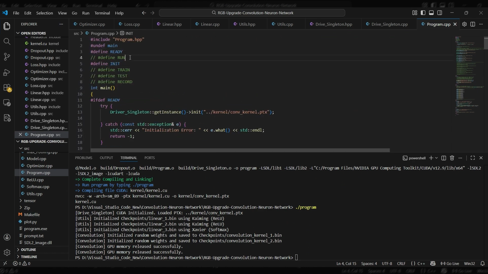
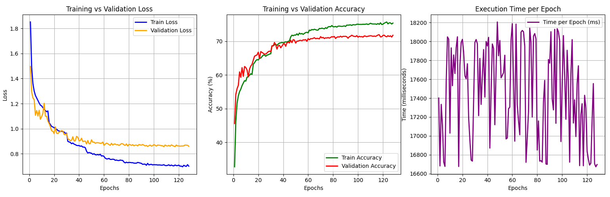
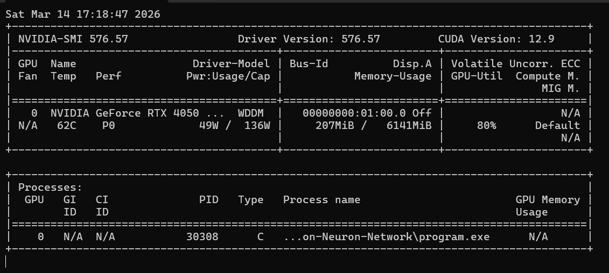

# Convolution Neural&nbsp;Network (NVIDIA GPU Implementation) for CIFAR-10 Dataset
This is a small, simple, solo, and personal project, which I attempt to gain insight into some features of coding on GPU (NVIDIA GPU specifically) and try to reimplement the renowned Convolution Neural Network. The current version here is NOT optimized yet (in the Kernel aspect), so in the future, maybe it will be reviewed and upgraded when I acquire enough knowledge. The origin of this project is another project that I reimplemented the whole structure of the traditional Convolution Neuron Network using C++ Xtensor. This latest version is just the transformation from sequential execution to parallel calculation.

## Main Feature:
The current version supports some layers:
- Convolution
- Max Pooling
- Linear
- ReLU (Leaky ReLU)
- Softmax
- Dropout (with input percentage)

The model is evaluated by a metric designed in Loss.

Dataset link: https://www.kaggle.com/c/cifar-10

When starting, the program automatically creates and shuffles the Dataset from the folder /Dataset (CIFAR-10) with 10 classes. The dataset contains 60.000 images, of which 50.000 are training images and the rest are testing images.

Weights and Biases are stored in binary files in the folder /Checkpoints, and they are automatically saved and written into the files every time the latest Validation Loss is improved.

A limit of 20 is set so that if 20 epochs have passed since the last Weights and Biases file saving, the Model is stopped to prevent power consumption and potential overfitting.

The Dataset also includes some state-of-the-art Data Augmentation, such as Horizontal Flip, Pixel Shift, or blackening an area.

The model also supports dividing and arranging Training Set into a Validation Set.

During the process of working on the project, manual mathematical calculation has been done to ensure the correctness of the theoractical fundamental, and only then was the process of coding started.

The project is also composed of some utility stuff and a Python program to "plot" the result.

## Technical Feature:
Dataset is designed to take advantage of multi-threading in C/C++ so that it can gain some speed-up during the batch division process.

SDL2 is chosen to use in Dataset to read images manually.

This project endeavors to keep the data on the VRAM of the GPU as long as possible to prevent data copying between Host (RAM &amp; CPU) and Device (VRAM &amp; GPU) due to the technical limitations of the throughput of the procedure.&nbsp;

The model is only tested to be run on Window environment and Visual Studio Code specifically, so I can not use the common syntax such as ```saxpy<<<blocksPerGrid, threadsPerBlock>>>(N, a, d_x, d_y);```. Instead, the CPP acts as a Front-end and the CU acts as a Back-end. The CPP will have to use a Driver_Singleton to load a function in CU, and it is called through a the bult-in function ```CUresult res = cuLaunchKernel(k_conv_forward, grid.x, grid.y, grid.z, block.x, block.y, block.z, 0, 0,&nbsp; args, 0 );```

Ensure deallocation in VRAM after the Model terminated to prevent memory leak.

## Demo:
Press the video below to see how to run the project.
> **Note**: This video was recorded by Clipchamp, which was using some GPU resources at the time of recording, so the program executed more slowly than normal.

[](https://youtu.be/qIfoXoPS5Pk?si=FiXC_C_kWZkik296)

## Result:




> **Note**: More details in the near future


